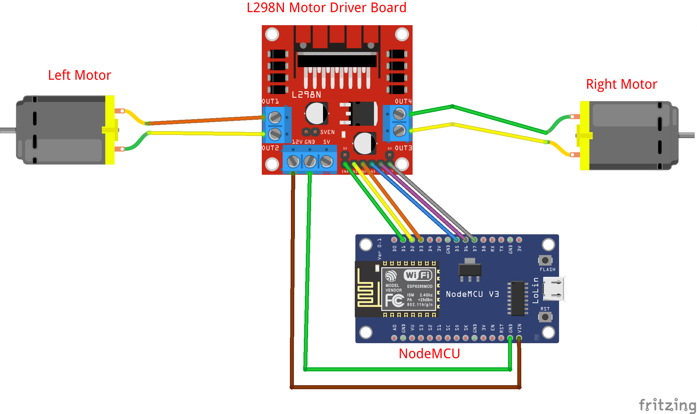

# ESP8266 motor driver

## Hardware Required

* Lolin NodeMCU Board
* Hook-up wires

## Circuit

### ESP82 GPIO
More info RandomNerdTutorial [ESP8266 Pinout Reference: Which GPIO pins should you use?](https://randomnerdtutorials.com/esp8266-pinout-reference-gpios/)

## Schematic
## See also
